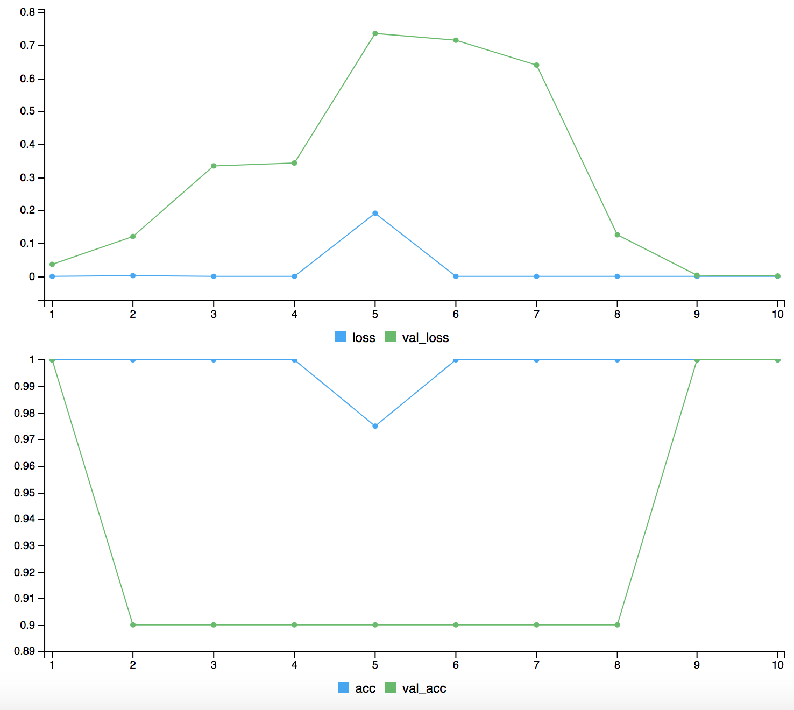

# p300Net
Implementation of a stateful Long Short-Term Memory (LSTM) Network for modeling individual event-related P300 EEG data with R (keras) and google's tensorflow Backend.

Training took about 129 seconds on a high performace GPU. Consider seriously extented training periods using average CPUs and serial computing. You can try the ParallelR package if you want to use parallel computing on your CPU.

The performance of the LSTM may vary due to the fact that training-trials are randomly drawn from a database.

Accuracy and lossfunctions over 10 epochs in iteration 9:

